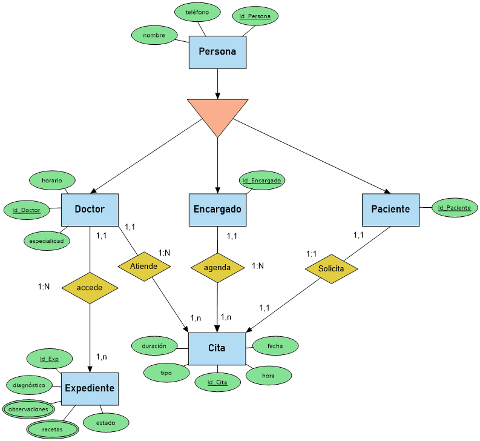

# 4. Modelo de Dominio

**a. Diagrama de clases**

- El diagrama de clases representa las entidades principales involucradas
en el sistema de gestión del consultorio médico, junto con sus
atributos, métodos y relaciones. Este modelo organiza las interacciones
entre actores como el Doctor, el Encargado, el Paciente, el Expediente,
y la Cita, proporcionando una estructura clara para el desarrollo del
sistema.

- Se incluyen cardinalidades que reflejan la relación lógica entre las
clases, como la capacidad del Doctor de gestionar múltiples expedientes
y la conexión del Encargado con la generación de citas para pacientes.
Este diagrama sirve como base para identificar los elementos clave del
sistema y su posterior implementación.

**b. Diagrama Entidad-Relación**

- El diagrama entidad-relación representa el modelo conceptual del sistema
que estamos proponiendo, mostrando así la interacción entre todas las
partes involucradas siendo una de las principales entidades en el
sistema las citas en las cuales 3 de las 5 actuales entidades se
relaciona entre sí (Encargado, Paciente y Doctor), las cuales heredan
parte de sus atributos de su entidad padre la cual es persona.

**c. Diagrama Relacional**

- En el modelo relacional se pueden apreciar mejor la relaciones entre las
clases y como se involucran entre sí, siendo lo más destacado que el
expediente además de relacionarse con el Doctor también lo hace con el
paciente al que debería estar asignado teniendo su FK dentro de la
tabla, además se destaca más la división entre encargado y paciente que
a pesar de no tener mucha diferencia dentro del esquema, ambos cumplen
roles y actividades diferentes.
