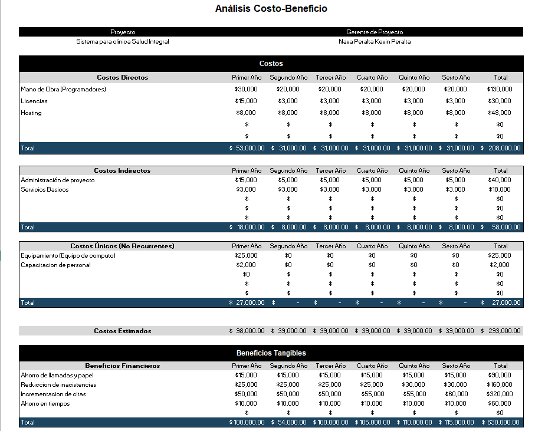

# 5. Estudio de factibilidad

## 1. Información del Proyecto

- **Empresa / Organización / Cliente:** Consultorio y Farmacia Salud Integral

- **Proyecto:** Sistema de Gestión de Citas Médicas y Administración de
Expedientes

- **Gerente / Líder de Proyecto:** Kevin Peralta Nava Peralta

## 2. Resumen Ejecutivo

El Consultorio y Farmacia Salud Integral actualmente enfrenta diversos
problemas debido al uso de métodos manuales para la gestión de citas,
expedientes clínicos e inventario. Conllevando a la generación de
retrasos en la atención, confusiones de las citas, riesgo de duplicidad
de registros y/o pérdida total de información y dificultad para
controlar los medicamentos disponibles.  
  
En este estudio de factibilidad se analizará la viabilidad de
implementar un sistema digital de gestión médica, cuyo objetivo es
optimizar los procesos internos, reducir tiempos de atención y mejorar
la seguridad y accesibilidad de la información.  
  
**Los resultados preliminares indican que:**

- **Técnicamente:** el sistema es viable, ya que puede desarrollarse con
  herramientas altamente confiables y flexibles para el propósito del
  proyecto (Java, MySQL, BPMN).

- **Económicamente:** el costo es bajo en comparación de los
  competidores ya que se utilizarán recursos ya disponibles y software
  libre.

- **Legalmente:** el sistema debe cumplir con la Ley de Protección de
  Datos Personales.

- **Operacionalmente:** el sistema encaja con los procesos actuales,
  requiriendo solo capacitación básica del personal.

- **Tiempo:** el proyecto puede desarrollarse en un periodo de 7 a 10
  meses para un prototipo funcional que pueda ser implementado para su
  experimentación y capacitación, con un plazo posterior de entre 2 a 3
  meses para la culminación del proyecto, esto sin tomar en cuenta la
  posible implementación de nuevas funciones al buscar ser un sistema
  escalable a futuro.

La implementación permitirá la solución de los problemas ya mencionados,
además de fortalecer la comunicación entre médicos, encargados y
pacientes que permitirá a futuro una mayor eficacia en la atención
médica.

## 3. Antecedentes del Proyecto

El cliente Salud Integral, maneja actualmente y en su totalidad las
operaciones de manera manual, registrando citas en agendas físicas,
controlando inventarios en cuadernos y manteniendo expedientes clínicos
en papel. Como se ha mencionado anteriormente, esto derivo a que se
generaran retrasos, pérdida de información y dificultades en el flujo de
pacientes. La necesidad de modernizar estas operaciones fue impulsada
tanto por las quejas de pacientes por largos tiempos de espera y la
falta de suministros médicos, como por los trabajadores y las
dificultades en manejar los expedientes y llevar acabo un registro
adecuado del inventario.  
  
El proyecto surge como iniciativa del equipo de Ingeniería en Sistemas
Computacionales, con el fin de implementar una solución tecnológica,
tanto eficiente, como adaptable a los problemas antes presentados del
actual cliente, Salud Integral. De igual manera se hace uso de la
documentación y estructura hecha por el equipo anteriormente mencionado
como base para la creación de este proyecto, que cuenta con diversas
entrevistas al cliente, los requerimientos del proyecto, distintos
diagramas sobre su estructura, etc.

## 4. El Proyecto y su Contexto

El proyecto consiste en desarrollar un sistema de gestión de citas
médicas, digitalización de expedientes clínicos y administración de
inventarios de farmacia.  
  
El consultorio actualmente es una clínica pequeña que atiende pacientes
locales. Sus procesos son hechos manualmente, pero la implementación de
un sistema digital responderá a la necesidad de eficiencia y organización.

Las entrevistas concedidas anteriormente por el cliente y realizadas por
el equipo de ISC, abarcaron distintos temas sobre la estructura y
funcionalidad de la clínica:

**- Gestión de citas.**
**- Atención al paciente.**  
**- Consulta médica.**  
**- Dispensación de medicamentos.**  
**- Gestión operativa.**  
**- Problemas y mejoras.**

Lo que permitió identificar tanto las diversas deficiencias dentro de
los procesos del cliente como en el enfoque y objetivos futuros para el
proyecto:  

**- Reducir los tiempos de espera mediante un sistema automatizado de citas.**  
**- Digitalizar expedientes para un acceso rápido y seguro.**  
**- Implementar un control de inventarios confiable y actualizado.**  
**- Garantizar la seguridad de la información sensible de los pacientes.**

## 5. Alcance del Estudio de Factibilidad

Con este estudio buscamos evaluar la factibilidad técnica, económica,
legal, de recursos, de mercado, operacional y de tiempo del proyecto.  
  
**Resultados esperados:**  
- Validar que el sistema es viable y cumpla con todas las necesidades.  
- Determinar los beneficios potenciales frente a los costos.  
- Identificar riesgos y limitaciones.  
  
**Actividades realizadas:** 
- Entrevistas con el cliente.  
- Modelado de procesos.  
- Definición de requerimientos funcionales y no funcionales.  
- Análisis de factibilidad.

## 6. Factibilidad Técnica

El proyecto utilizará tecnologías conocidas por el equipo (Java, MySQL,
BPMN) permitirán una mayor flexibilidad y escalabilidad para los motivos
del proyecto.

Los recursos tecnológicos actuales del consultorio (Equipo de
escritorio, red local) son suficientes para implementar el sistema. Se
prevé capacitación básica al personal para el uso del sistema.

Para el alojamiento del sistema se utilizará el proveedor de alojamiento
web, Hostinger, ya que se enfoca en seguridad y rendimiento.

Este servicio ofrece certificados SSL gratis, protección contra ataques DDoS y copias
de seguridad diarias. Su infraestructura SSD asegura tiempos de carga
rápidos, cruciales para la atención a los pacientes, además de contar
con planes con múltiples recursos que permiten la escalabilidad del
proyecto.

## 7. Factibilidad Económica

El proyecto requiere una inversión mediana pero menor a un sistema más
complejo, ya que se utilizará software libre y hardware existente y el
servicio de alojamiento de Hostinger ofrece planes accesibles y
descuentos de fidelidad.

Los beneficios incluyen reducción de pérdidas por errores manuales,
mayor eficiencia en atención al paciente y optimización de tiempo y una
disminución significativa en los gastos de administración. El análisis
costo-beneficio muestra una clara ventaja en implementar el sistema, se
puede notar como incluso dentro del primer año la inversión inicial se
recupera y en la acumulación estimada en 6 años llega a triplicar la
inversión al sistema en el tiempo.

## 8. Factibilidad Legal

**Normativas aplicables**

- **Ley Federal de Protección de Datos Personales en Posesión de los
  Particulares (México):** obliga a garantizar la confidencialidad,
  integridad y disponibilidad de los datos personales y sensibles, como
  los historiales clínicos de los pacientes.

- **Norma Oficial Mexicana NOM-024-SSA3-2012:** establece los
  lineamientos para los sistemas de información de registros
  electrónicos en salud, asegurando interoperabilidad, seguridad y
  confidencialidad.

- **Derechos de autor y licencias de software:** se utilizarán
  herramientas de software libre (Java, MySQL, GitHub), por lo que no
  existen conflictos en términos de propiedad intelectual o
  licenciamiento.

- **Ley de Responsabilidad y Portabilidad del Seguro Médico (HIPAA):**
  Esta legislación, diseñada principalmente para salvaguardar los datos
  de los pacientes, impone estándares rigurosos a las aplicaciones que
  manejan información médica protegida.

**Implicaciones legales para el sistema**

- Los datos médicos y personales de los pacientes deberán almacenarse en
  bases de datos con acceso restringido únicamente al personal
  autorizado (médicos y encargado).

- Se debe implementar un sistema de usuarios y contraseñas para cumplir
  con la trazabilidad de accesos.

- Será necesario contar con avisos de privacidad para los pacientes,
  informando sobre el uso y protección de sus datos.

- El sistema debe considerar copias de seguridad cifradas para evitar la
  pérdida o divulgación no autorizada de información.

**Costos legales asociados**

- Elaboración del Aviso de Privacidad: puede hacerse con un modelo
  básico (sin costo elevado).

- Cumplimiento de la NOM-024-SSA3-2012: implica ajustes técnicos, pero
  es alcanzable dentro del diseño del sistema.

- Capacitación básica al personal en protección de datos: mínima
  inversión en comparación con los beneficios.

## 9. Factibilidad de Recursos

El proyecto requiere recursos humanos, materiales y de infraestructura
que son accesibles tanto para el equipo desarrollador como para el
consultorio. La disponibilidad de estos recursos garantiza que el
sistema pueda desarrollarse e implementarse sin dificultades
significativas.

**Recursos humanos**

- **Equipo de desarrollo:** conformado por 4 estudiantes de Ingeniería
  en Sistemas Computacionales, con conocimientos en programación, bases
  de datos y modelado de software.

- **Supervisor académico:** docente de Fundamentos de Ingeniería de
  Software, quien valida metodologías y avances.

- **Cliente/usuario clave:** encargado del consultorio y farmacia, quien
  aporta retroalimentación sobre los procesos actuales y valida los
  requerimientos.

- **Médicos y personal de apoyo:** usuarios finales que utilizarán el
  sistema y requerirán capacitación básica.

- **Personal adicional:** no se requiere contratación de nuevo personal;
  el sistema será operado por el personal existente en el consultorio.

**Recursos materiales e infraestructura**

- **Computadoras:** disponibles en el consultorio, con capacidad
  suficiente para ejecutar el sistema.

- **Servicio de hosting:** para alojar la base de datos y respaldos (se
  recomienda equipo dedicado, pero puede iniciarse con infraestructura
  actual).

- **Conexión a internet y red local:** ya existente, suficiente para la
  implementación inicial.

- **Papelería mínima:** solo en fase de transición hasta que el sistema
  esté totalmente en uso.

**Dependencias y procedimientos de desarrollo**

- **Dependencias internas:** coordinación con el encargado y médicos
  para validar flujos de trabajo.

- **Dependencias externas:** proveedores de medicamentos, en caso de
  integrar inventario automatizado a sus entregas.

- **Procedimientos de desarrollo:** el proyecto seguirá una metodología
  iterativa e incremental, permitiendo entregar versiones funcionales y
  realizar pruebas con el personal del consultorio.

**Impacto en operaciones**

**Durante la fase de implementación, será necesario:**

- Capacitar al personal para que adopte el nuevo sistema.

- Realizar pruebas sin interrumpir el servicio normal.

- Ajustar procesos manuales a la al sistema digital.

Una vez implementado, el impacto será positivo al reducir errores,
agilizar la atención y optimizar el control de medicamentos.

## 10. Factibilidad de Mercado

El sistema propuesto está orientado a clínicas pequeñas, consultorios
médicos y farmacias locales que aún dependen de procesos manuales para
la gestión de citas, expedientes y control de inventarios. Este sector
del mercado presenta una alta demanda de soluciones tecnológicas
económicas y fáciles de implementar.

**Mercado objetivo**

- **Segmento principal:** clínicas y consultorios pequeños en zonas
  urbanas y semiurbanas, en específico ajustado a las necesidades del
  cliente.

- **Usuarios clave:** médicos, encargados de consultorios, farmacias
  locales y pacientes que buscan un servicio más eficiente.

**Competencia**

Actualmente, existen sistemas de gestión médica en el mercado, pero
presentan las siguientes limitaciones frente a nuestro proyecto:

- Alto costo de adquisición y licenciamiento.

- Complejidad en la implementación, diseñada para hospitales grandes y
  no para clínicas pequeñas.

- Requerimientos de infraestructura avanzados, difíciles de cubrir en
  consultorios locales.

**Diferenciación del sistema propuesto**

- El sistema destaca frente a competidores porque:

- Utiliza software libre (cero costos de licencias).

- Está diseñado a la medida de consultorios pequeños, con procesos
  simplificados.

- Ofrece facilidad de uso para personal no especializado en informática.

- Brinda escalabilidad, permitiendo añadir nuevas funciones a futuro sin
  necesidad de cambiar el sistema.

**Estrategia de adopción y distribución**

- **Distribución inicial:** implementación directa en el consultorio
  Salud Integral como prototipo.

- **Escalabilidad:** posibilidad de adaptar a futuras necesidades del
  cliente.

**Valor agregado para el cliente final (paciente):** reducción de
tiempos de espera, mejor organización de citas y disponibilidad de
medicamentos.

## 11. Factibilidad Operacional

El sistema propuesto es operacionalmente viable, ya que se adapta al
flujo de trabajo actual del consultorio y mejora significativamente los
procesos administrativos y médicos.

**Simbiosis con el entorno de negocios**

Actualmente, el consultorio Salud Integral realiza todos sus procesos de
forma manual (citas en cuadernos, expedientes en papel, inventario en
libretas). El sistema propuesto se integra en estas actividades,
sustituyendo el registro manual por una herramienta digital centralizada
que:

- **Automatiza la gestión de citas.**

- **Digitaliza expedientes médicos.**

- **Optimiza el control de inventario.**

Esto asegura una transición ordenada, donde los procesos actuales se
mantienen, pero mejorados con el soporte del sistema.

**Resolución de problemas identificados**

El sistema atiende directamente los principales problemas encontrados en
el diagnóstico:

- **Retrasos en la atención:** ahora las citas se gestionan en tiempo
  mínimo y con recordatorios.

- **Pérdida de información:** la digitalización de expedientes y
  respaldos automáticos minimiza el riesgo.

- **Inventario inexacto:** la gestión digital reduce faltantes y
  caducidad de medicamentos.

- **Falta de comunicación interna:** todos los actores (médicos,
  encargado, farmacia) acceden a información compartida en el mismo
  sistema.

**Resultados operacionales esperados**

- **Reducción de tiempos** de espera de pacientes.

- **Disminución de errores** en el registro de citas y recetas.

- **Acceso más rápido** y seguro a la información médica.

- **Mayor satisfacción** del paciente por la organización y
  confiabilidad en el servicio.

- **Optimización** en la toma de decisiones del encargado mediante
  reportes básicos del sistema.

**Impacto en la organización**

- **Cultura organizacional:** el personal adoptará una cultura de
  digitalización, reduciendo la dependencia de registros manuales.

- **Capacitación mínima:** el sistema es intuitivo, por lo que el
  personal podrá adaptarse rápidamente incluso sin conocimiento previo.

- **Procesos internos:** se vuelven más ágiles, con menos pasos
  redundantes y mejor comunicación entre áreas.

## 12. Factibilidad de Tiempo

El proyecto es viable en términos de tiempo, ya que puede desarrollarse
y ser operativo en un plazo razonable, de acuerdo con las necesidades
del consultorio y los objetivos académicos del equipo desarrollador.

**Tiempo de desarrollo estimado**

El sistema puede completarse en un plazo de 7 – 10 meses siguiendo una
metodología iterativa e incremental.

**Las fases consideradas son:**

Análisis y diseño (1 a 2 mes).

Desarrollo del sistema (4 a 5 meses).

Pruebas, correcciones y retroalimentación con el consultorio (2 mes).

Capacitación y puesta en marcha (2 semanas).

**Afectaciones a las operaciones**

Durante el desarrollo, el consultorio podrá seguir operando de forma
manual sin interrupciones, la fase de pruebas se realizará en paralelo a
los procesos actuales, asegurando que no haya riesgos de pérdida de
datos, al igual que se recibirá retroalimentación de parte del personal
en caso de algún percance o mal entendido durante el desarrollo.

La transición será gradual: primero se digitalizarán citas, luego
expedientes y finalmente inventarios.

**Tiempo de recuperación**

El sistema permitirá recuperar la inversión inicial en un plazo estimado
de menos de un año, debido a la reducción de costos por papelería y
almacenamiento físico, sumado a la disminución de errores y pérdidas en
inventarios, harán posible la optimización del tiempo de atención, lo
que mejora la productividad del consultorio.

## 13. Recomendaciones y Aprobación

Tras el análisis realizado en las diferentes dimensiones de
factibilidad, se concluye que el Sistema de Gestión de Citas Médicas,
Expedientes Clínicos e Inventarios para el Consultorio y Farmacia Salud
Integral es un proyecto altamente viable y recomendable.

**Beneficios identificados**

- **Beneficios tangibles:** reducción de tiempos de espera, mejor
  control de inventarios, disminución de errores en registros y
  digitalización de expedientes médicos.

- **Alta viabilidad técnica:** el equipo de desarrollo cuenta con
  conocimientos y herramientas necesarias, utilizando software libre.

- **Adaptabilidad y escalabilidad:** el sistema puede crecer junto con
  la clínica o implementarse en otros consultorios similares.

- **Cumplimiento legal:** se apega a la normativa de protección de datos
  y lineamientos de registros electrónicos en salud.

**Contras y riesgos**

- Resistencia o mal uso al uso de equipo de cómputo por parte del
  personal debido a estar ubicada en una zona rural.

- Necesidad de capacitación básica, lo que puede generar dificultad de
  adaptación inicial.

- El consultorio pasará de un esquema manual a digital, requiriendo
  copias de seguridad periódicas para evitar pérdida de datos que
  dependen de un proveedor externo (Hostinger).

**Probabilidad de éxito**

> **La probabilidad de éxito del proyecto es muy alta (≥85%), ya que:**

- Se ajusta a las necesidades específicas del consultorio.

- Aprovecha infraestructura existente.

- Cuenta con apoyo de los usuarios clave y supervisión académica.
