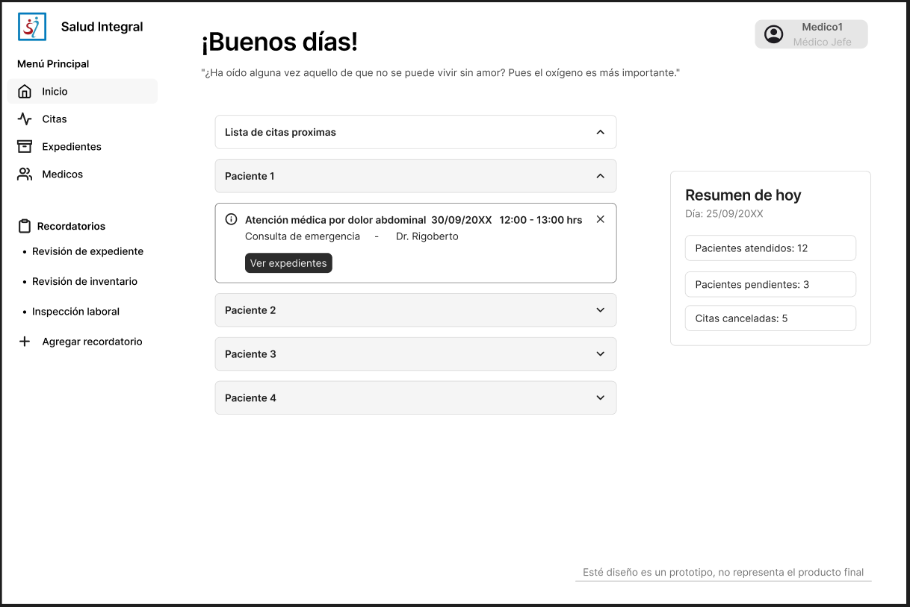
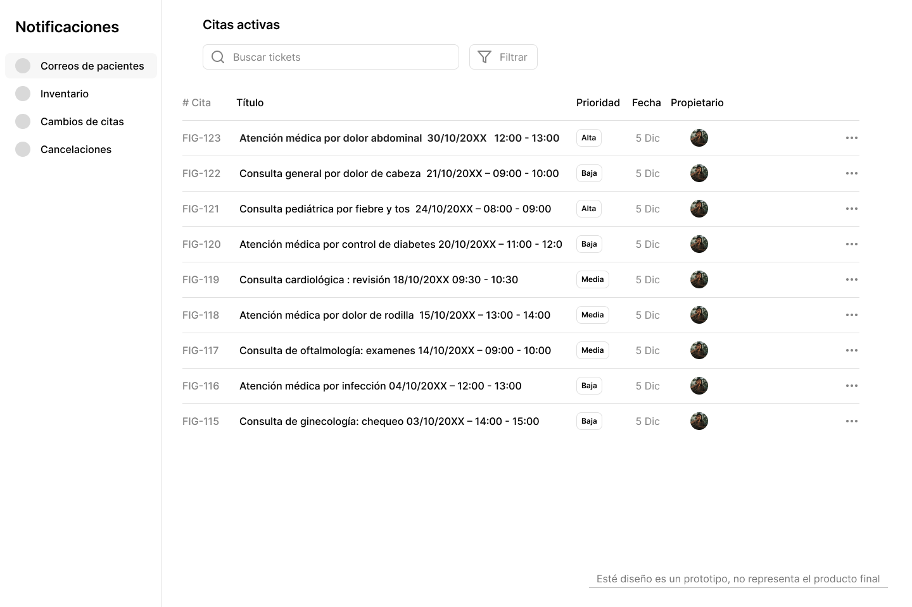

# 7. Diseños prototipo del sistema

## Menú principal

**Minimalista, sencillo e intuitivo para el usuario.**

## Sección de notificaciones generales

**De diseño sencillo pero intuitivo y fácil de usar para el usuario.**

## Inicio de registro para pacientes

**Dos tipos de registro de sesión, por medio de correos y códigos
telefónicos para pacientes sin un correo.**
